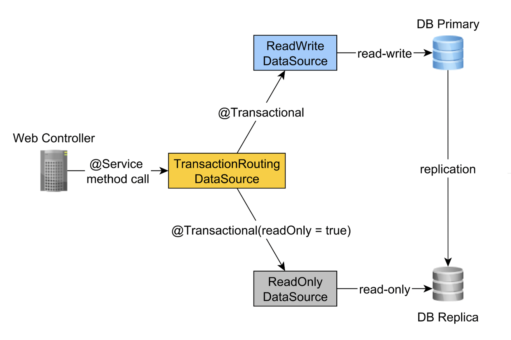

# Transactional routing

The aim of this application is to implement a read-write transactional routing.





```docker run --name some-postgres -p 5432:5432 -e POSTGRES_PASSWORD=postgres -d postgres```